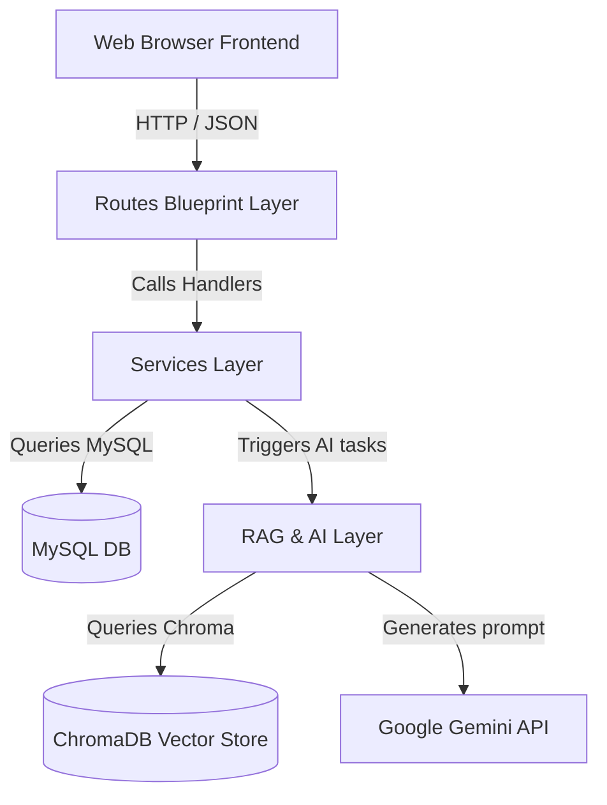
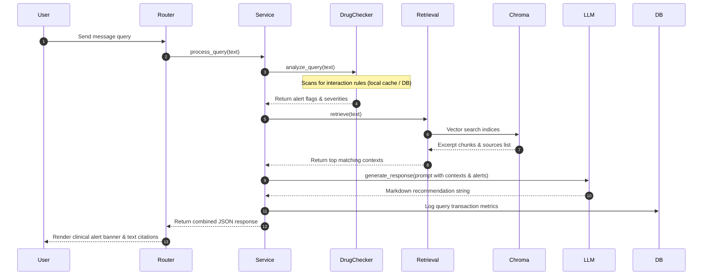

# MedQuery – Architecture Specifications

This document outlines the layered architecture, data flows, and storage entities of the **MedQuery** application.

---

## 1. System Topology Overview

MedQuery follows **Clean Architecture** principles, dividing dependencies into isolated layers to ease unit-testing, scalability, and code maintenance.

### Layer Responsibilities
* **Presentation Layer (`templates/`, `static/`)**: Formulates the user interface using responsive HSL variables, glassmorphic forms, and dynamic chat views.
* **Routing Controllers (`routes/`)**: Intercepts HTTP requests, parses payloads, handles REST compliance, and translates exceptions into JSON responses.
* **Business Service Layer (`services/`)**: Orchestrates functional transactions, coordinates task queues, updates status flags, and manages database sessions.
* **RAG & AI Engine (`rag/`)**: Coordinates semantic indices, performs sliding-window chunking, creates embeddings using local Sentence Transformers, retrieves vectors, and routes reasoning to Google Gemini.
* **Storage Layer (`database/`, `chroma_db/`)**: Relational MySQL stores audit logs and interaction databases. ChromaDB manages local vector partitions.

---

## 2. Retrieval-Augmented Generation (RAG) Flow

The chat query sequence leverages secondary checking rules to ensure clinical guidance safety:

---

## 3. Database Entities Mappings

### Relational Tables (MySQL / SQLAlchemy)
1. **`documents`**: Tracks reference library inventory, sizes, and indexing phases (`pending` &rarr; `processing` &rarr; `completed` / `failed`).
2. **`queries`**: Audits conversations history, user text inputs, citation metadata, and alert classifications.
3. **`drug_interactions`**: Authorized pairs catalog mapping severe reactions (e.g. Aspirin + Warfarin).

### Vector Collections (ChromaDB)
* Contains text partitions with embeddings vectors (dimension: 384) mapping coordinates metadata pointing back to MySQL document identifiers.
